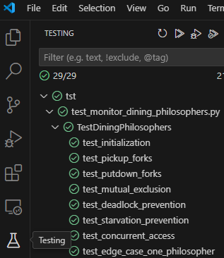

# SISO: Sincronización de procesos

> [!Note]
> Todavía sigue en desarrollo para añadir más scripts y tests.

## Índice

1. [Introducción](#introducción)
2. [Ejecución de los scripts](#ejecución-de-los-scripts)
3. [Ejecucción de los tests](#ejecución-de-los-tests)
4. [Contribuidores del proyecto](#contribuidores-del-proyecto)
5. [Licencia](#licencia)

## Introducción

He resuelto en Python los pseudocódigos de las diapositivas de Sistemas Operativos (SISO) para comprobar su funcionamiento real.

## Ejecución de los scripts

1. Tener instalado Python 3.10 o superior. Puedes descargarlo desde [aquí](https://www.python.org/downloads/).
2. Ejecutar el srcipt que se desee visualizar.

En Windows:
```bash
python src/<script>.py
```

En Linux:
```bash
python3 src/<script>.py
```

## Ejecucción de los tests

Hay dos formas:
1. Ejecutar el script de test directamente:

En Windows:
```bash
cd tst
python -m unittest discover -s . -p "*.py"
```

En Linux:
```bash
cd tst
python3 -m unittest discover -s . -p "*.py"
```

2. Ejecutar el script de test desde un IDE. Recomiendo Visual Studio Code.



## Referencias

- Universidad de Burgos. (2025, 11 de abril). Sincronización de procesos. https://ubuvirtual.ubu.es/pluginfile.php/1059498/mod_resource/content/4/05%20-%20Sincronizaci%C3%B3n%20de%20Procesos%20-%201-4.pdf

## Contribuidores del proyecto

<table>
    <tr>
        <td align="center"><a href="https://joseleelportfolio.vercel.app/"><br /><sub><b>José Gallardo</b></sub></a></td>
    </tr>
</table>

## Licencia

Este proyecto está bajo la Licencia MIT. Para más información, consulta el archivo [LICENSE](LICENSE).
